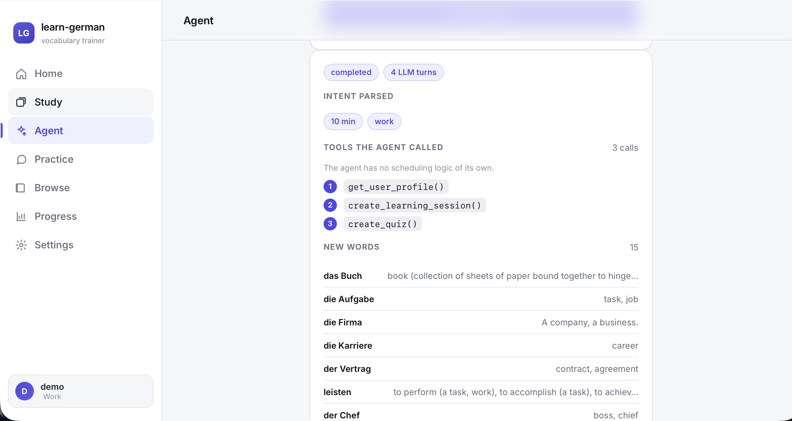

# learn-german

An adaptive German-vocabulary trainer where you start a study session by
**asking for one in plain English**. An LLM agent parses the request and calls
**MCP tools** to build the session; a deterministic spaced-repetition core
decides which words. Built to show agent/MCP orchestration with real evaluation
behind it, not UI polish.

**Live:** <https://deutsch-ai.duckdns.org> — log in with `demo` / `demo`
(deployed from `main` by GitHub Actions).



## The idea

Most SRS apps make you drive — pick a deck, pick a length, grind. Here the entry
point is *"I have 10 minutes, German for work"*, and the agent turns that into a
session.

The one thing the agent must **not** do is decide what to review. Which cards
are due, and when to show them again, is a solved problem with a deterministic
algorithm (SM-2), and it needs to stay reproducible and unit-testable. So:

- the **LLM does the language** — it reads the request and infers *minutes* and
  *topic*, and nothing else;
- a **deterministic core** (`backend/core`, zero LLM imports, checked in CI) does
  all the scheduling;
- **MCP tools are the seam** between them. The agent touches data only through
  tool calls, even though the MCP server runs in-process.

A **second MCP server** — a Markdown notes vault — is wired into the same agent,
so one conversation can span two unrelated tool surfaces. It's a genuinely
separate process with its own storage; a test asserts it shares no code with the
first.

## How the agent runs

```
"I have 10 minutes, German for work"
        │
   agent  (backend/agent/orchestrator.py) — Anthropic tool-use loop
        │   parses intent, then calls tools; never picks words or dates
   ┌────┴─────────────┐
   │ MCP #1 learning  │  get_user_profile → create_learning_session → create_quiz
   │ MCP #2 notes     │  log_progress (append a dated section to progress.md)
   └────┬─────────────┘
   backend/core        SM-2, time budget, word selection — deterministic
        │
   PostgreSQL          review_logs (source of truth) · card_states cache · sessions
```

Every LLM turn and tool call is written to a JSON-lines trace
(`backend/tracing/`). Sample traces, including a cross-server one, are in
[`docs/sample-traces/`](docs/sample-traces/).

## What's where

| area | package | notes |
|---|---|---|
| deterministic core | `backend/core/` | SM-2, session budgeting, new-word selection. No LLM or HTTP imports (an AST test enforces it); 100% line/branch coverage. |
| agent | `backend/agent/` | intent → tool loop → session + quiz; cross-server conversations; a weekly mistake-pattern job that reads labelled misses from server #1 and writes findings to the vault on server #2; fault injection + a recovery-rate report; an offline eval harness. |
| MCP server #1 | `backend/mcp_servers/learning_server/` | 11 tools + a `vocab://` resource. Own process and transport. |
| MCP server #2 | `backend/mcp_servers/secondary_server/` | a Markdown notes vault. Own process, own storage, no shared code with server #1. |
| tracing | `backend/tracing/` | JSON lines: name, input, output, latency, success. |
| quiz + grading | `backend/study/` | quiz construction; exact/fuzzy grading with an LLM path for free-text. Shared by the MCP server and the API. |
| learner model | `backend/learner_model/` | forgetting-curve simulator, Half-Life Regression, the SM-2-vs-HLR evaluation. |
| data pipeline | `backend/data/` | Leipzig frequency + Wiktionary enrichment → ~4,000 A1–B2 words. Function words dropped first, then CEFR assigned by rank among the survivors. Seed committed; raw corpora gitignored. |
| API + frontend | `backend/api/`, `frontend/` | thin FastAPI (CRUD + `/study/*` + a minimal login) serving a no-build single-page app: Home, Study, **Coach** (the NL entry point), Practice, Browse, Progress. |

More detail and the design rationale: [`docs/ARCHITECTURE.md`](docs/ARCHITECTURE.md),
[`docs/DESIGN.md`](docs/DESIGN.md).

## Evaluation

I built three harnesses because "it demos" isn't evidence.

**Agent** — [`docs/AGENT_EVAL.md`](docs/AGENT_EVAL.md). ~12 labelled
natural-language requests run through the real agent and scored on intent
parsing, tool-call sequence, and session sanity (checked against the DB, not the
model's claims — the review words really are due, the "new" words really are
unseen). Currently 11–12/12 on `claude-haiku-4-5`; topic inference on a bare
"study German" request is the weak spot, and the doc says so.

**Learner model** — [`docs/EVALUATION.md`](docs/EVALUATION.md). Random vs. SM-2
vs. Half-Life Regression through a synthetic learner simulator:

| strategy | recall | review efficiency | Brier | AUC |
|---|---|---|---|---|
| random | 0.04 | 0.005 | 0.25 | 0.50 |
| sm2 | 0.49 | 0.022 | 0.09 | 0.90 |
| hlr | 0.92 | 0.013 | 0.12 | 0.84 |

HLR gets the highest retention (by scheduling ~2× the reviews); SM-2 is the most
efficient and best-calibrated. The offline SM-2 recall (0.489) matches a real
`review_logs` table driven by the actual scheduler (0.481) to within 0.008.

**Failure handling** — [`docs/FAILURE_RECOVERY.md`](docs/FAILURE_RECOVERY.md).
Timeouts, malformed tool responses and stripped-ambiguous requests injected into
real agent runs: tool-call success 62%, recovery 71%, graceful-handling 100%
(never crashes or hangs).

## Run it

Docker:

```bash
cp .env.example .env          # set ANTHROPIC_API_KEY (only the agent needs it)
docker compose up             # Postgres + backend (migrates + seeds, serves the SPA) + both MCP servers
```
App at <http://localhost:8000/>, Swagger at `/docs`.

Local, no Docker:

```bash
uv sync --extra dev --extra agent
uv run pytest                                   # 633 tests

export DATABASE_URL="sqlite+pysqlite:///local.db"
uv run python -m backend.db.seed
uv run uvicorn backend.api.main:app --port 8000 &

uv run python -m backend.agent "I have 10 minutes, German for work" --auto
uv run python -m backend.agent --converse "10-minute work session, and note where I'm at"

# regenerate the eval docs (need ANTHROPIC_API_KEY):
uv run python -m backend.agent.eval
uv run python -m backend.agent.eval.capture
uv run python -m backend.learner_model.report
uv run python -m backend.agent.recovery
```

## CI/CD

`.github/workflows/ci.yml` — a **core** job that installs no `mcp`/`anthropic`
and runs the deterministic packages with a coverage gate plus the import-purity
test, and a **full** job that runs everything (633 tests).

`.github/workflows/cd.yml` — on push to `main`: run CI, build the image, push to
GHCR, then SSH to the host and `docker compose up -d --wait`. See
[`deploy/`](deploy/).

## What I'd change with more time

- The agent is narrow on purpose, but one genuinely multi-step flow (read the
  week's mistakes → plan several sessions → write them to the vault) would show
  more of the orchestration.
- Topic inference on vague requests is the shakiest part — noted in the agent eval.
- Tracing is JSON lines; a Langfuse/OTel exporter behind the same interface would
  make cross-run analysis easier.
