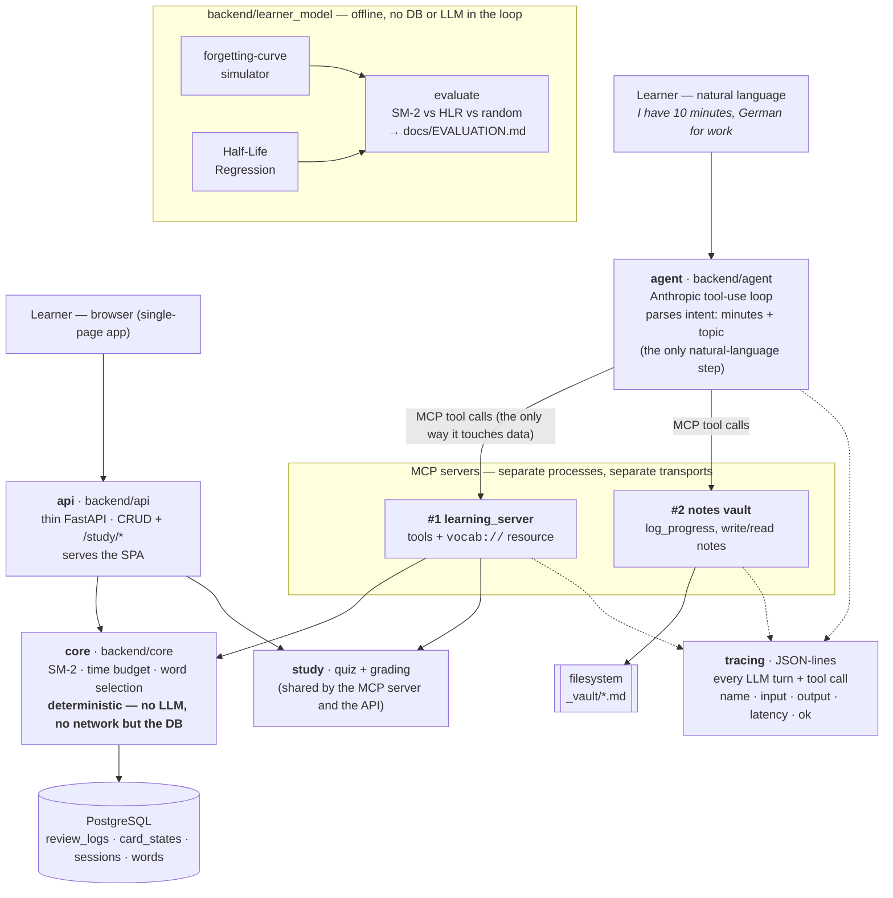

# Architecture

## The shape



Read it top to bottom: a request enters as language (left) or through the SPA
(right). The **agent** makes one judgement — minutes and topic — then calls
**MCP tools**. Those tools are the only path to data, even in-process. Behind
them the **deterministic core** does every scheduling decision. The
**learner_model** package is offline: it never runs in a request, it produces
the evaluation.

## Design rules — and where they're enforced

| # | principle | enforced by |
|---|---|---|
| 1 | The scheduler is **deterministic**, zero LLM dependency, fully unit-testable. | `backend/core/` — pure Python + SQLAlchemy only; `test_import_purity.py` AST-scans it for `anthropic`/`mcp`/`httpx`/…; 100% statement + branch coverage; a `core` CI job installs no LLM packages at all. |
| 2 | The agent **never computes** scheduling decisions — it calls tools. | The orchestrator's system prompt forbids picking/reordering/inventing words or computing dates; `create_learning_session` is the one call that composes; the "intent" it extracts is just that call's arguments. |
| 3 | **MCP tools are the only way** the agent touches the data layer — even in-process. | The agent reaches data only through `MCPToolClient` / `MultiServerToolClient`, which call an `MCPServer`. No `backend.db` import in `backend/agent/`. Tool bodies themselves call only `backend.core` (`scheduler` + `read_models`), never ad-hoc queries. |
| 4 | **Every tool call and agent decision is traced** — from day one. | `backend/tracing/tracer.py`; the MCP servers wrap every tool + resource with `trace_tool_call`; the orchestrator emits an `agent_decision` per LLM turn; the fault injector emits `fault_injected`. |
| 5 | The two MCP servers are **genuinely independent** processes. | Separate packages, separate `python -m …` entry points, separate ports, separate storage (Postgres vs. the filesystem vault). `test_secondary_server.py` AST-asserts server #2 imports nothing from server #1 / `backend.core` / `backend.db`. |

## Request flow — a study session

1. **Agent parses intent.** `run_session("I have 10 minutes, German for work")`
   starts an Anthropic tool-use loop. The first assistant turn works out
   `minutes_available` and `topic`. Traced as `agent.turn`.
2. **Agent gathers context (optional).** It may call `get_user_profile`,
   `get_words_due_for_review`, `get_weak_words`, `get_new_words` on MCP server #1.
   Each hits `backend/core` and returns typed `WordView` / `UserProfile`.
3. **Agent composes the session.** `create_learning_session(user_id, minutes,
   topic)` → `scheduler.create_learning_session` runs `plan_budget` (time →
   review/new slot counts), fills review slots from SM-2-due words and new slots
   from CEFR-gated frequency-ordered unseen words, persists a `sessions` row,
   returns a hydrated `SessionView`.
4. **Agent builds the quiz.** `create_quiz(word_ids, quiz_type)` → self-contained
   base64 `question_id`s (no server-side question store).
5. **Answers come in.** `LearningSession.answer(qid, text)` runs a fixed
   `evaluate_answer` → `update_learning_state` pair (no LLM turn):
   `evaluate_answer` grades (exact/fuzzy, or the LLM for free text with a fuzzy
   fallback); `update_learning_state` appends one `review_logs` row — from which
   the SM-2 `CardState` is *reconstructed* (there is no card-state table).
6. **`finish_learning_session`** records `words_covered` and returns a summary.

Cross-server (`run_conversation`): the same loop, but the tool set is the union
of both servers; *"…and note where I'm at"* makes the agent call `log_progress`
on server #2, appending a dated section to `_vault/progress.md`. The trace
interleaves `learning.tool.*` and `notes.tool.*` with `agent.turn` between them.

## Data model

```
words(id, lemma, article, plural, translation_en, cefr_level, frequency_rank, topic, ipa_or_audio_ref)
users(id, created_at, target, username, password_hash)   -- target: work / travel / general / exam
review_logs(id, user_id, word_id, timestamp, correct, response_time_ms, source, error_type)  -- error_type: diagnostic label on a wrong free-text answer
card_states(user_id, word_id, repetitions, ease_factor, interval_days, reviews, correct_reviews,
            last_reviewed, due_at)                        -- derived cache, see below
sessions(id, user_id, started_at, duration_minutes_requested, words_covered, topic)
```

`review_logs` is the append-only source of truth. `card_states` is a **derived
cache** of each card's SM-2 state, updated incrementally by
`scheduler.update_after_review` and rebuildable from the logs at any time
(`rebuild_user_card_states`); it turns the due-list / weak-list / dashboard reads
into indexed look-ups instead of replaying every log in Python per request.

Schema is owned by Alembic (`backend/db/migrations/`); `seed.sql` is data-only.
CEFR level is *approximated* from frequency band, and topic from a gloss-keyword
tagger — both documented as approximations, not ground truth.

## Failure handling

`backend/agent/failure_injection.py` wraps the tool client to deliberately time
out a call, return a malformed response, or (as a request transformer) strip a
request of its cues. `backend/agent/recovery.py` drives seven scenarios through
real agent runs and classifies the outcome — *recovered / clarified /
failed_gracefully / crashed / hung* — then writes
[`FAILURE_RECOVERY.md`](FAILURE_RECOVERY.md). The agent never hangs (injected
timeouts raise after a capped delay) and never crashes; it retries, works
around, asks for clarification, or reports a clear partial failure.
