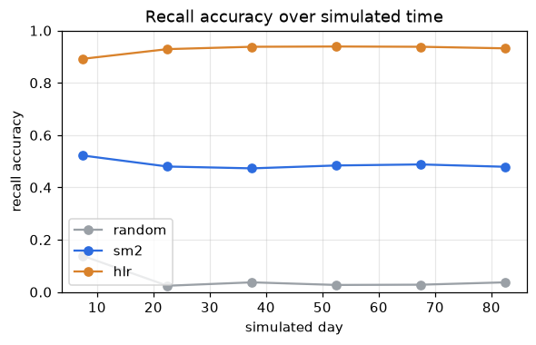
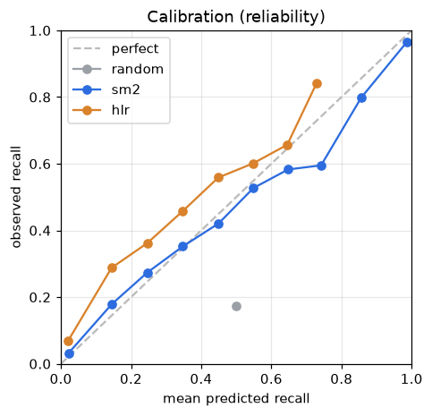
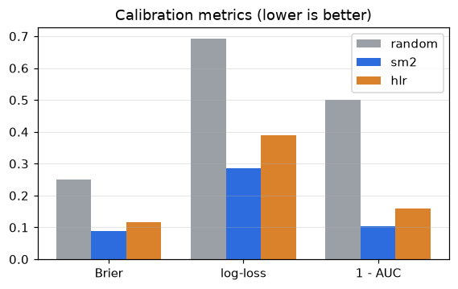
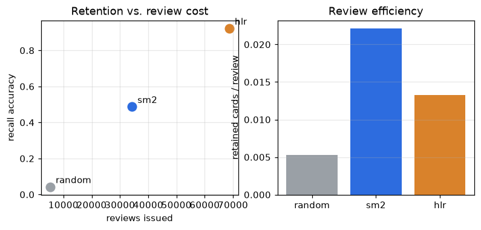

# Evaluation

> Generated by `python -m backend.learner_model.report` — deterministic, no API
> key. Simulator: `backend/learner_model/simulator.py`. Config:
> 8 learners/type · 40 words · 90-day horizon · seed 0.

Three scheduling strategies are compared on the synthetic learner simulator:
**random** (uniform intervals, no model), **sm2** (the deterministic
`backend.core.scheduler`), and **hlr** (a Half-Life Regression model trained once
on held-out learners, then frozen).

## Headline

| strategy | recall (retention) | review efficiency | reviews | Brier | log-loss | AUC |
|---|---|---|---|---|---|---|
| random | 0.043 | 0.005 | 5296 | 0.250 | 0.693 | 0.5 |
| sm2 | 0.488 | 0.022 | 34237 | 0.087 | 0.285 | 0.8956 |
| hlr | 0.923 | 0.013 | 68642 | 0.117 | 0.388 | 0.8396 |

- **HLR maximises retention** (recall 0.92) by scheduling aggressively — at
  2.0× SM-2's review count.
- **SM-2 is the most review-efficient** and, on the probe schedule, the
  best-calibrated (its interval read as a half-life is a decent probability).
- **random** is the floor: recall 0.04, chance-level calibration (AUC 0.50).

HLR weights (log2 half-life = θ·x): `{'bias': 0.1112, 'sqrt_correct': 0.3011, 'sqrt_incorrect': -0.1917, 'difficulty': 0.0505}` — √correct positive,
√incorrect negative, as expected. Training loss 0.544 → 0.534.

## Plots

## Validation against real logged sessions

The simulator eval runs SM-2 in memory. As a cross-check,
`backend/learner_model/real_data.py` runs the **actual** `backend.core.scheduler`
against a real (in-memory SQLite) `review_logs` table over a
90-day timeline (6 users ×
30 words), with the simulator deciding each outcome, and
reads the persisted rows back.

| source | SM-2 recall accuracy | n review_logs |
|---|---|---|
| offline eval (simulator, `average` learner) | **0.489** | — |
| real scheduler + real `review_logs` | **0.481** | 6838 |

Δ = 0.008 — the offline evaluation's SM-2 retention number matches the real
pipeline to within a percentage point.
