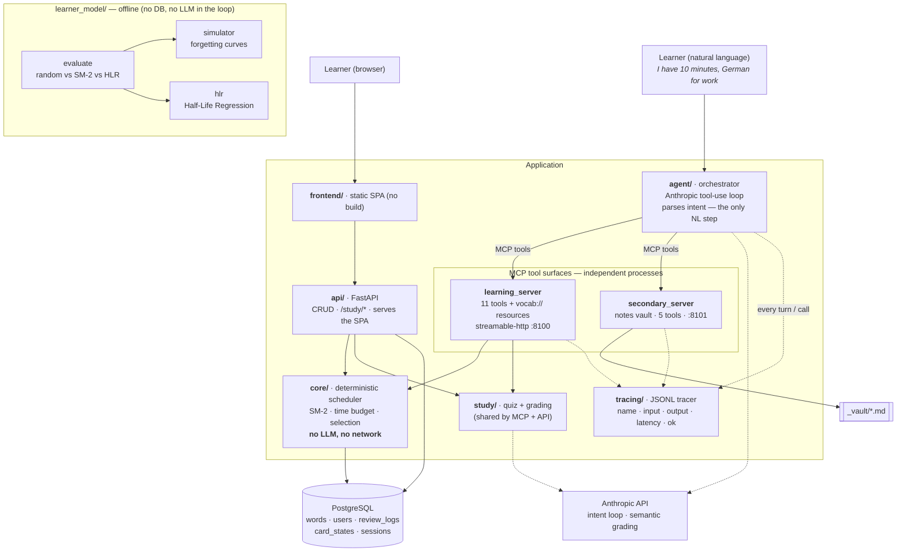
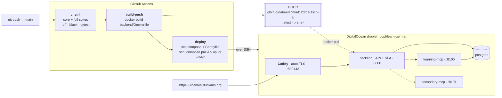

# Architecture diagrams

Paste either block straight into `README.md` — GitHub renders Mermaid inline.
To export a PNG/SVG, drop the same code into <https://mermaid.live>.

## System

## CI/CD & deployment

